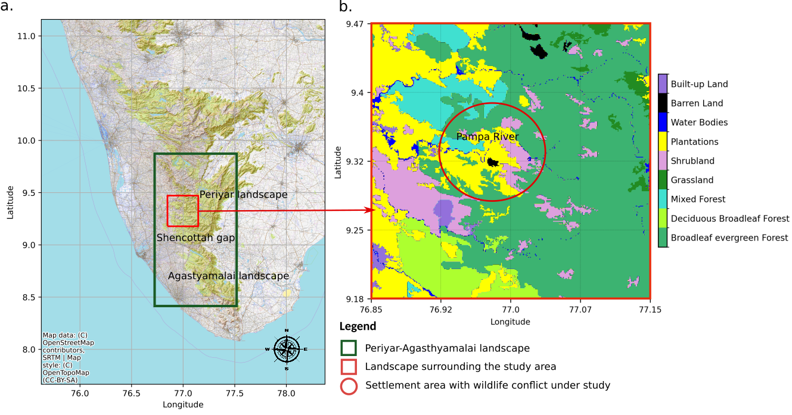
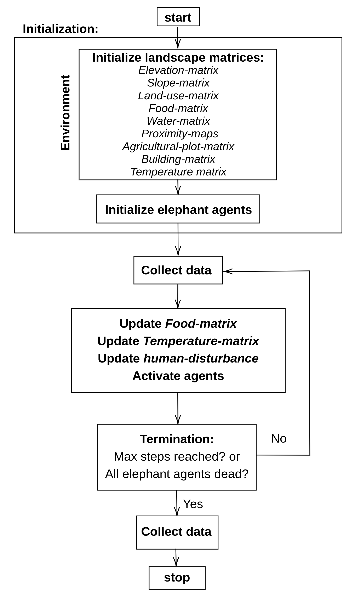
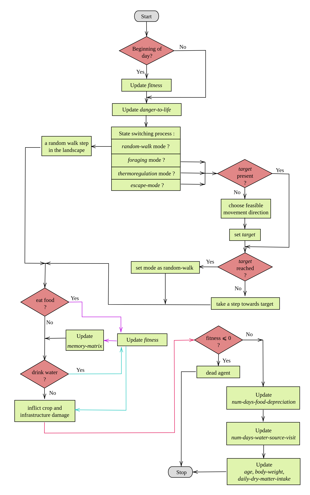

# abm-elephant project codebase

The code base of the agent-based model for human-elephant conflict simulations.

## Study Area


## Schematic of the model


## Process Schematic


## Elephant Agent Decision Making


## data 

- `data`: contains the data used in the model: the field data and the elephant movement data


The `requirements.txt` file should list all libraries that is necessary for model runs. You can install the requirements using the following command: 

```pip install -r requirements.txt```

## Running the model:

1. server run: ```python mesageo_elephant_project/elephant_project/server/conflict_model_Server.py``` \
    Launches the browser based server for the model run visualisation. \
    outputs are collected at: "mesageo_elephant_project/elephant_project/outputs/server_run" 

2. batch run: ```python mesageo_elephant_project/elephant_project/run/run_multiple.py``` \
    Runs the model in batch mode for multiple iterations. \
    outputs are collected at: "mesageo_elephant_project/elephant_project/outputs/batch_run" 
